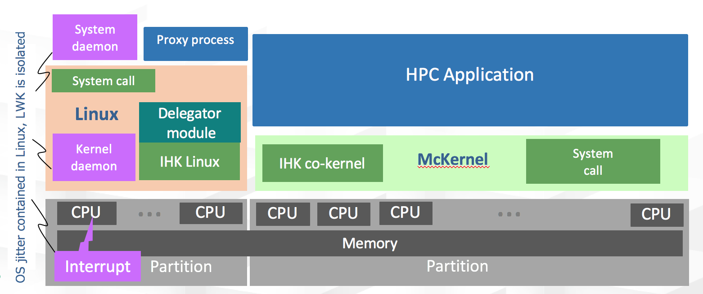
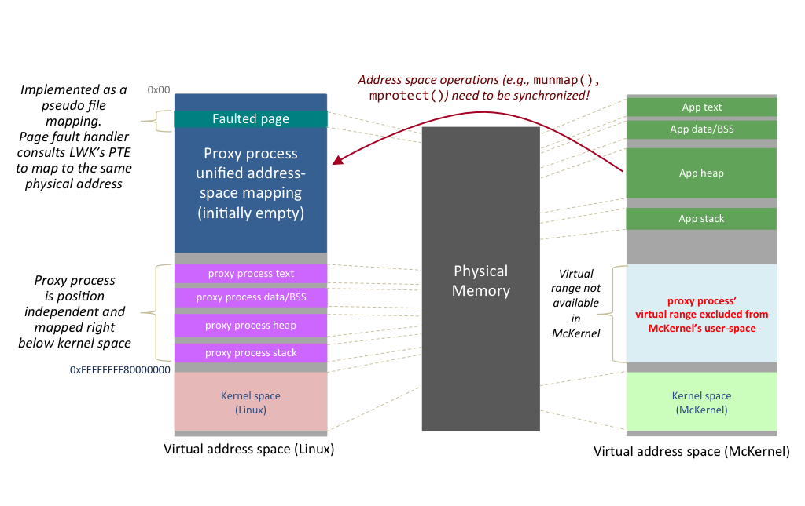

Architectural Overview
======================

At the heart of the stack is a low-level software infrastructure called
Interface for Heterogeneous Kernels (IHK). IHK is a general framework
that provides capabilities for partitioning resources in a many-core
environment (e.g.,CPU cores and physical memory) and it enables
management of lightweight kernels. IHK can allocate and release host
resources dynamically and no reboot of the host machine is required when
altering configuration. IHK also provides a low-level inter-kernel
messaging infrastructure, called the Inter-Kernel Communication (IKC)
layer. An architectural overview of the main system components is shown
below.

McKernel is a lightweight kernel written from scratch. It is designed
for HPC and is booted from IHK. McKernel retains a binary compatible ABI
with Linux, however, it implements only a small set of performance
sensitive system calls and the rest are offloaded to Linux.
Specifically, McKernel has its own memory management, it supports
processes and multi-threading with a simple round-robin cooperative
(tick-less) scheduler, and it implements signaling. It also allows
inter-process memory mappings and it provides interfaces to hardware
performance counters.

Functionality
-------------

An overview of some of the principal functionalities of the IHK/McKernel
stack is provided below.

System Call Offloading
~~~~~~~~~~~~~~~~~~~~~~

System call forwarding in McKernel is implemented as follows. When an
offloaded system call occurs, McKernel marshals the system call number
along with its arguments and sends a message to Linux via a dedicated
IKC channel. The corresponding proxy process running on Linux is by
default waiting for system call requests through an ioctl() call into
IHK’s system call delegator kernel module. The delegator kernel module’s
IKC interrupt handler wakes up the proxy process, which returns to
userspace and simply invokes the requested system call. Once it obtains
the return value, it instructs the delegator module to send the result
back to McKernel, which subsequently passes the value to user-space.

Unified Address Space
~~~~~~~~~~~~~~~~~~~~~

The unified address space model in IHK/McKernel ensures that offloaded
system calls can seamlessly resolve arguments even in case of pointers.
This mechanism is depicted below and is implemented as follows.

First, the proxy process is compiled as a position independent binary,
which enables us to map the code and data segments specific to the proxy
process to an address range which is explicitly excluded from McKernel’s
user space. The grey box on the right side of the figure demonstrates
the excluded region. Second, the entire valid virtual address range of
McKernel’s application user-space is covered by a special mapping in the
proxy process for which we use a pseudo file mapping in Linux. This
mapping is indicated by the blue box on the left side of the figure.
